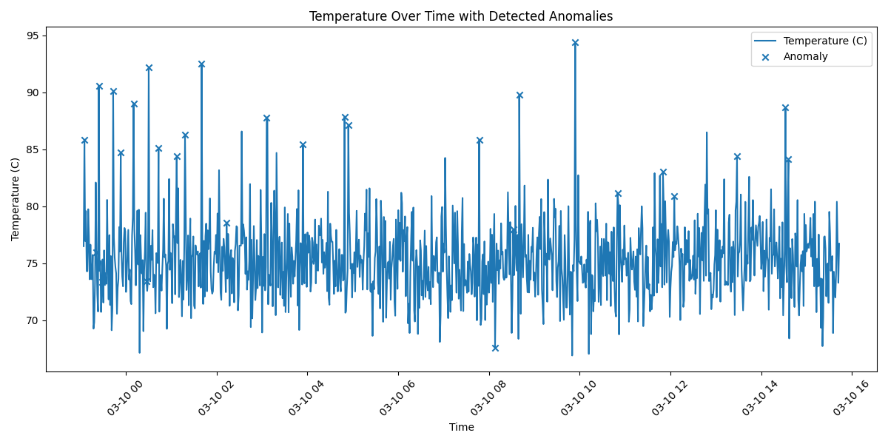
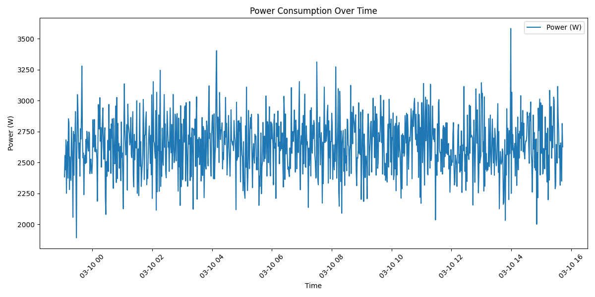

# Endüstriyel Enerji Verimliliği ve Anomali Tespit Sistemi
## Görseller

### Sıcaklık Anomalileri

### Güç Tüketimi

Bu proje, endüstriyel bir üretim hattından elde ediliyormuş gibi simüle edilen sensör verileri üzerinden **anomali tespiti**, **enerji tüketimi analizi** ve **veri görselleştirme** yapan yapay zekâ destekli bir prototiptir.

Sistem; sıcaklık, titreşim, akım, voltaj ve çevrim süresi gibi kritik parametreleri analiz ederek üretim süreçlerinde oluşabilecek olağan dışı durumların erken fark edilmesini amaçlar.

## Proje Özeti

Endüstriyel tesislerde ekipman arızaları, enerji kayıpları ve üretim verimsizlikleri çoğu zaman sensör verilerindeki küçük değişimlerle önceden fark edilebilir. Bu projede, üretim hattını temsil eden veriler yapay olarak üretilmiş ve bu veriler üzerinde makine öğrenmesi tabanlı anomali analizi uygulanmıştır.

Projede geliştirilen yapı ile:

- üretim hattı verileri simüle edilmiştir,
- anormal çalışma davranışları tespit edilmiştir,
- enerji tüketim eğilimleri analiz edilmiştir,
- sonuçlar grafiklerle görselleştirilmiştir.

Bu çalışma; **endüstriyel dijitalleşme**, **kestirimci bakım**, **proses izleme** ve **enerji verimliliği** alanlarına giriş niteliğinde bir prototip sunmaktadır.

## Amaç

Bu projenin temel amacı, sensör verileri kullanılarak:

- üretim süreçlerinde oluşabilecek anomalileri erken tespit etmek,
- ekipman davranışlarını izlemek,
- enerji tüketimini analiz etmek,
- veri odaklı karar destek yapısının temelini oluşturmaktır.

## Kullanılan Teknolojiler

- **Python**
- **Pandas**
- **NumPy**
- **Scikit-learn**
- **Matplotlib**

## Kullanılan Yaklaşım

Projede önce bir üretim hattını temsil eden sahte veri seti oluşturulmuştur. Bu veri setinde şu parametreler yer almaktadır:

- sıcaklık
- titreşim
- akım
- voltaj
- güç tüketimi
- çevrim süresi

Daha sonra bu veriler üzerinde **Isolation Forest** algoritması kullanılarak anomali tespiti yapılmıştır. Son aşamada ise analiz sonuçları grafikler yardımıyla görselleştirilmiştir.

## Proje Dosya Yapısı

- `data_generator.py`  
  Simüle edilmiş üretim hattı verisini oluşturur.

- `anomaly_detection.py`  
  Makine öğrenmesi kullanarak veri üzerinde anomali tespiti yapar.

- `visualize_results.py`  
  Analiz edilen verileri grafik haline getirir.

- `sample_production_data.csv`  
  Oluşturulan örnek üretim verisini içerir.

- `analyzed_production_data.csv`  
  Anomali analizi uygulanmış veri setini içerir.

- `temperature_anomalies.png`  
  Sıcaklık verisi üzerinde tespit edilen anomalileri gösterir.

- `power_consumption.png`  
  Güç tüketiminin zamana göre değişimini gösterir.

